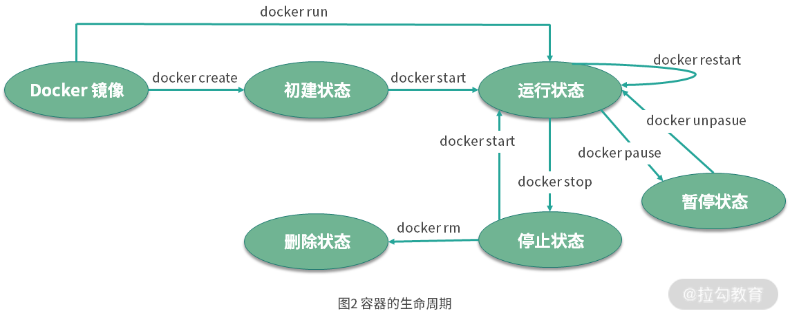

# 容器操作

## 容器生命周期转换关系

  

## 创建并启动容器

方式：
- 使用docker create命令来创建容器
- 使用docker start命令基于已经创建好的容器直接启动 
- 使用docker run命令直接基于镜像新建一个容器并启动，相当于先执行docker create命令从镜像创建容器，然后再执行docker start命令启动容器

案例命令格式：
- docker create -it --name=busybox busybox
- docker start busybox
- docker run -it --name=busybox busybox

执行流程分解：
- docker create
  - 检查本地是否存在 busybox 镜像，如果镜像不存在则从 Docker Hub 拉取 busybox 镜像
  - 使用 busybox 镜像创建并启动一个容器
  - 分配文件系统，并且在镜像只读层外创建一个读写层
  - 从 Docker IP 池中分配一个 IP 给容器
- docker start
  - 执行用户的启动命令运行镜像

一般日志如下：
```
$ docker create -it --name=busybox busybox
Unable to find image 'busybox:latest' locally
latest: Pulling from library/busybox
61c5ed1cbdf8: Pull complete
Digest:sha256:4f47c01fa91355af2865ac10fef5bf6ec9c7f42ad2321377c21e844427972977
Status: Downloaded newer image for busybox:latest
2c2e919c2d6dad1f1712c65b3b8425ea656050bd5a0b4722f8b01526d5959ec6
```

## 停止或重启容器

方式：
- 使用docker stop命令来停止容器
- 使用docker restart命令会将一个运行中的容器终止，并且重新启动它

案例命令格式：
- docker stop [-t|--time[=10]] [RUNNING_CONTAINER_NAME]
- docker stop busybox
- docker restart busybox

执行流程分解：
- docker stop
  - 该命令首先会向运行中的容器发送 SIGTERM 信号
  - 如果容器内 1 号进程接受并能够处理 SIGTERM，则等待 1 号进程处理完毕后退出
  - 如果超出设置的等待时间后，容器仍然没有退出，则会发送 SIGKILL 强制终止容器

## 进入容器

方式：
- 使用 docker exec 命令进入容器

案例命令格式：
- docker exec -it [RUNNING_CONTAINER_NAME] sh
- docker exec -it busybox sh

执行流程分解：
- docker exec
  - 以 exec 的方式进入容器，会单独启动一个 sh 进程，每个连接都是独立且互不干扰的

## 删除容器

方式：
- 使用docker rm 命令删除一个停止状态的容器
- 使用docker rm -f命令删除一个正在运行中的容器，Docker 会发送 SIGKILL 信号强制终止正在运行的容器

案例命令格式：
- docker rm [OPTIONS] CONTAINER [CONTAINER...]
- docker rm busybox
- docker rm -f busybox

## 迁移容器

方式：
- 使用docker export CONTAINER命令导出一个容器到文件，不管此时该容器是否处于运行中的状态
- 使用docker import命令导入，执行完docker import后会变为本地镜像，最后再使用docker run命令启动该镜像

案例命令格式：
- docker export busybox > busybox.tar （将导出的文件复制到其他机器）
- docker import [OPTIONS] file|URL [REPOSITORY[:TAG]]
- docker import busybox.tar busybox:test