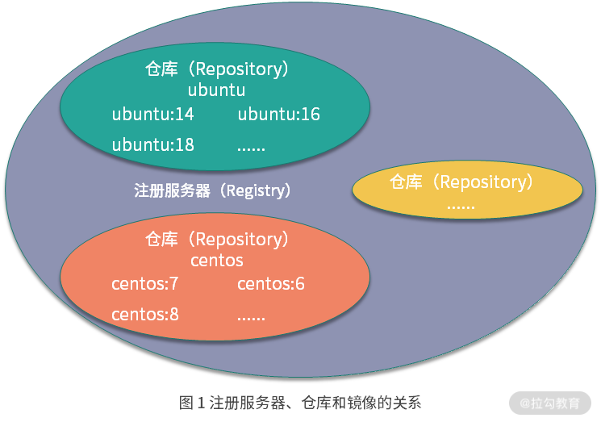

# 镜像操作

## 拉取镜像

命令格式：
- docker pull [:Registry]/[:Repository]/[Image]:[:Tag]
- docker pull [Image]

具体的参数解释如下：
* Registry 为注册服务器，是存放镜像的实际服务器，默认为 docker.io ，可以替换为自己的注册服务器
* Repository 为镜像仓库，通常把一组相关联的镜像归为一个镜像仓库，是一种逻辑归类。默认镜像仓库为 library，一个注册服务器可以包含多个镜像仓库
* Image 为镜像名称
* Tag 为镜像的标签，不指定默认为 latest


注册服务器、仓库、镜像关系如下：  
  

<br>

一般日志如下：
```
$ docker pull busybox
Using default tag: latest
latest: Pulling from library/busybox
61c5ed1cbdf8: Pull complete
Digest: sha256:4f47c01fa91355af2865ac10fef5bf6ec9c7f42ad2321377c21e844427972977
Status: Downloaded newer image for busybox:latest
docker.io/library/busybox:latest
```

## 查看镜像

命令格式：
- docker tag [SOURCE_IMAGE][:TAG] [TARGET_IMAGE][:TAG]

案例：
- docker tag busybox:latest mybusybox:latest

## 重命名镜像

作用：
- 自定义镜像名称
- 推送镜像到其他镜像仓库

命令格式：
- docker images | grep busybox
- docker image ls busybox

## 删除镜像

命令格式：
- docker rmi [Image]:[:Tag]
- docker image rm [Image]:[:Tag]

具体的参数解释如下：
* Tag 为镜像的标签，不指定默认为 latest

案例：
- docker rmi mybusybox

## 构建镜像

方式：
- 使用 docker build 命令从 Dockerfile 构建镜像，默认找寻目录下 Dockerfile 文件
- 使用 docker commit 命令从运行中的容器提交为镜像

命令格式：
- docker build -t [IMAGE][:TAG] [DIR_PATH]
- docker commit [RUNNING_CONTAINER_NAME] [IMAGE][:TAG]

案例：
- docker build -t mybusybox .
- docker commit busybox busybox:hello

## 常用镜像

### BusyBox

BusyBox 是一个开源的、轻量级的软件工具集合，旨在提供一个精简的 Unix 工具集，集成了三百多个最常用Linux命令和工具的软件，适用于嵌入式系统和资源受限的环境，如路由器、交换机、机顶盒和移动设备。由于其体积小巧，它可以帮助这些设备节省存储空间和内存。  
